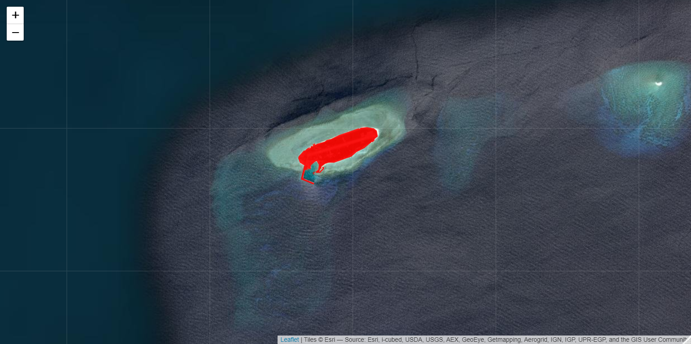
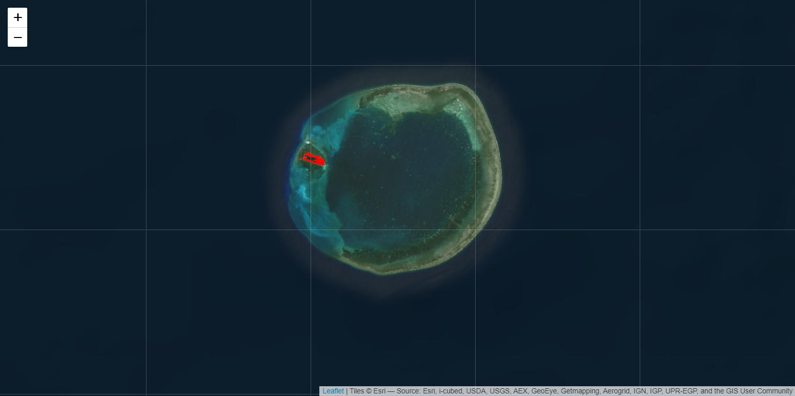

# Map of Taiwan

---

This R script generated an interactive map of Taiwan  Data are provided as .shp and are downloaded from https://data.moi.gov.tw/ 

Author: Vianney DENIS 
Email: vianney.denis@gmail.com
Last update by  on Feb.20th, 2023
Source of the data: https://data.moi.gov.tw/ (now: data.gov.tw)

